Documentation
----------------

Overview
^^^^^^^^^

The cirrocumulus interface consists of an app bar, side bar, primary embedding, embedding gallery and toolbar, distribution plots, and differential expression results explorer.

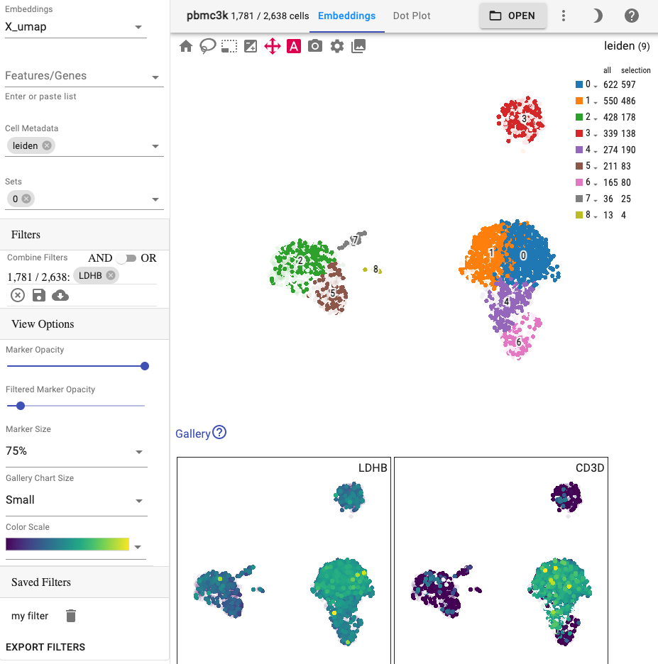

Primary embedding
^^^^^^^^^^^^^^^^^^^

The primary view is an interactive 2 or 3-dimensional embedding:

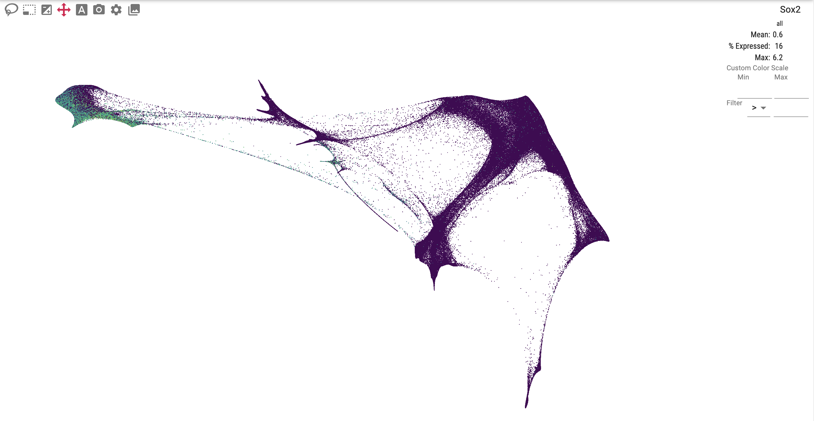

For spatial data, you can overlay genes or cell metadata on top of an image:

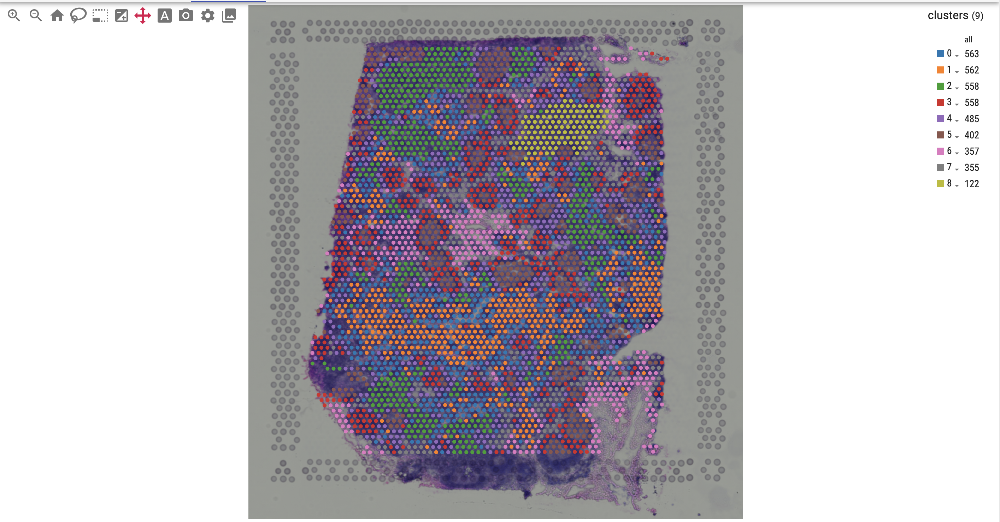

Interact with the view:

- Pan: Mouse left click (2-d), right click (3-d)
- Hover: Hover a data point to see the underlying value
- Rotate 3-d: Mouse left click
- Zoom: Mouse wheel
- Select: When using lasso or select tool, hold down the Ctrl or Command key to add to selection
- Resize: Click and drag the divider below the primary embedding
- Tooltip: Mouse move
- Select Category: Mouse double-click

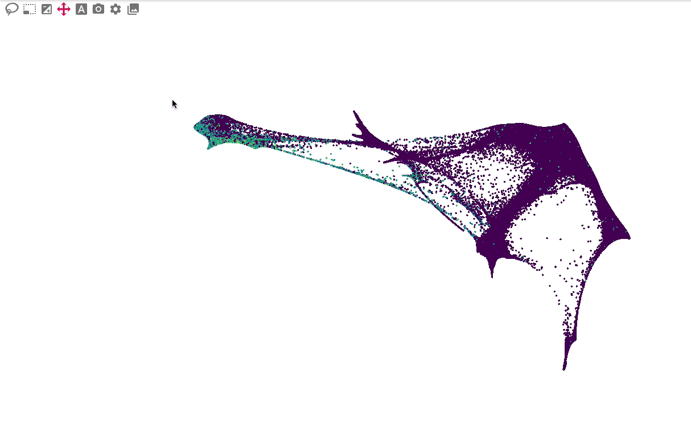

The primary embedding view enables fast, interactive exploration of 1.3 million cells. Note that higher values are plotted on top of lower values for genes, whereas categorical values are plotted in random order:

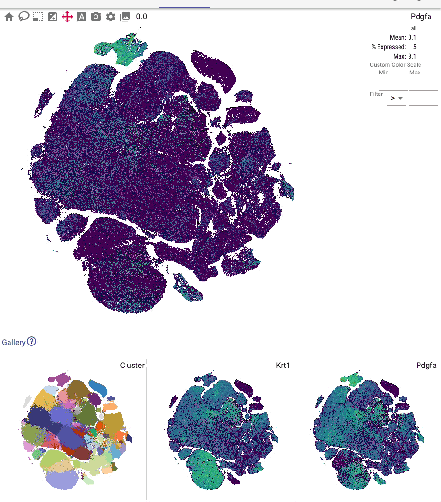

You can interactively annotate clusters (optionally using a controlled vocabulary), and include positive and negative cluster markers:

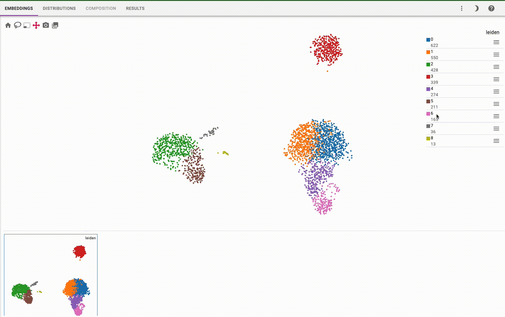

Toolbar
^^^^^^^^^^^

Use the toolbar to change the active tool. The lasso and brush tools allow you to visually select cells of interest:

.. image:: images/lasso.gif

The "Append to selection" button controls whether the lasso and brush tools append to the selection.

Click the label button to toggle the visibility of categorical labels directly on the embedding:

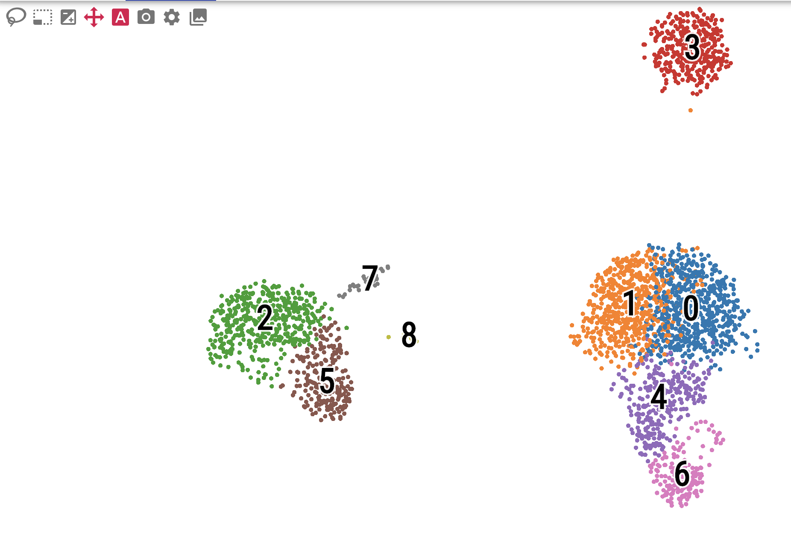

In a 3-d plot, use the play button to rotate the plot in a loop.

.. image:: images/play3d.gif

and toggle whether to fade distant points or to show a 3-d axis:

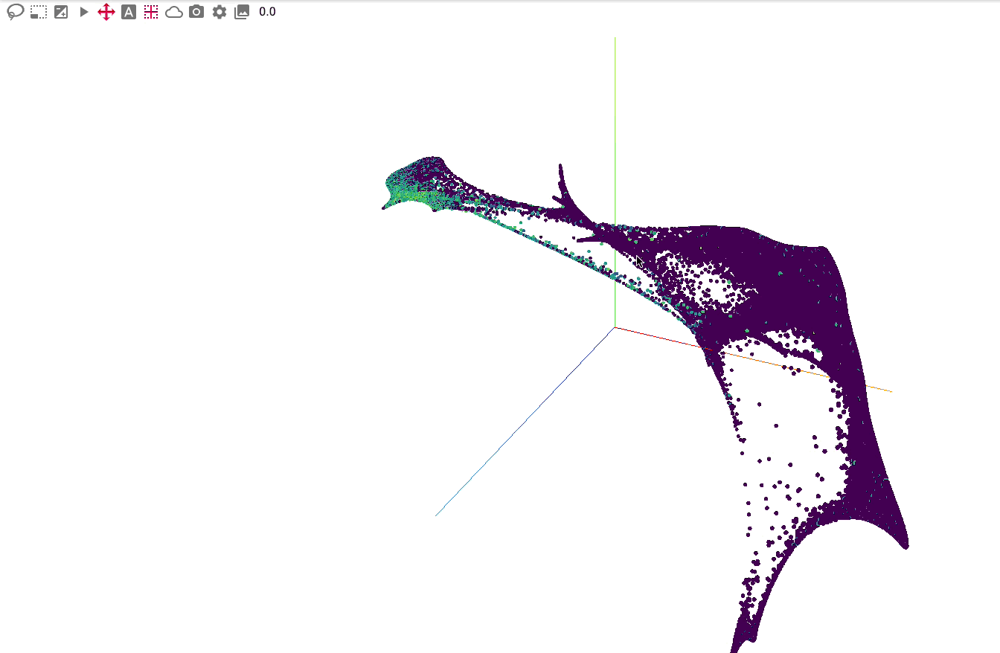

Additional buttons include saving the embedding image to svg or png.

Gallery view
^^^^^^^^^^^^^^^^^^^

The gallery view, which is displayed below the main plot, shows all selected features and embeddings and thus provides a way for comparing attributes and embeddings.
The following example shows the IL7R gene and leiden clusters in a UMAP and TSNE embedding:

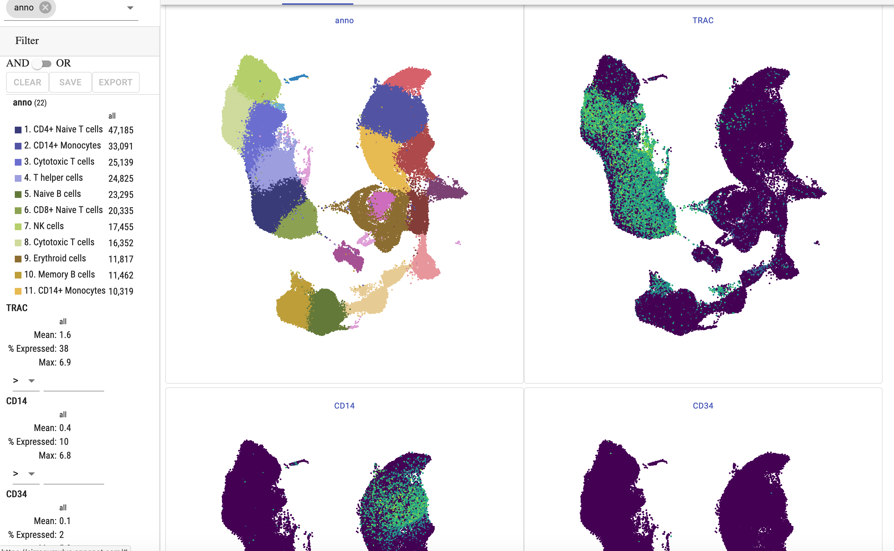

Additionally, when you select cells, all plots have these cells highlighted:

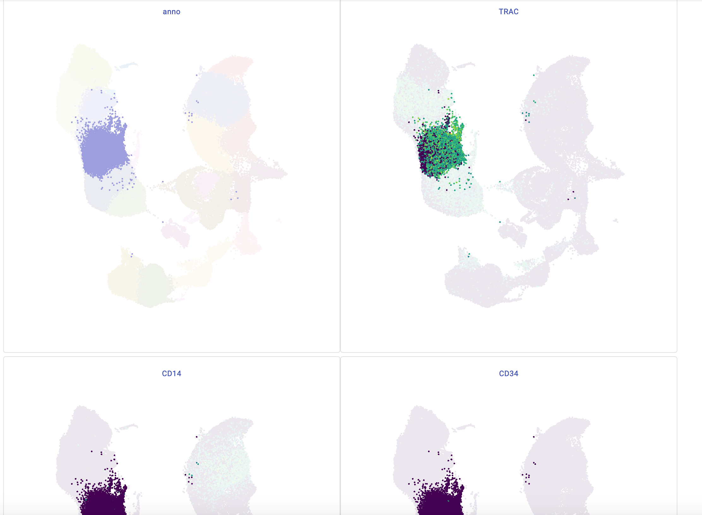

The gallery plot size can be changed in the side bar.

Drag and drop gallery charts to reorder them or click on a chart to make it the primary view.

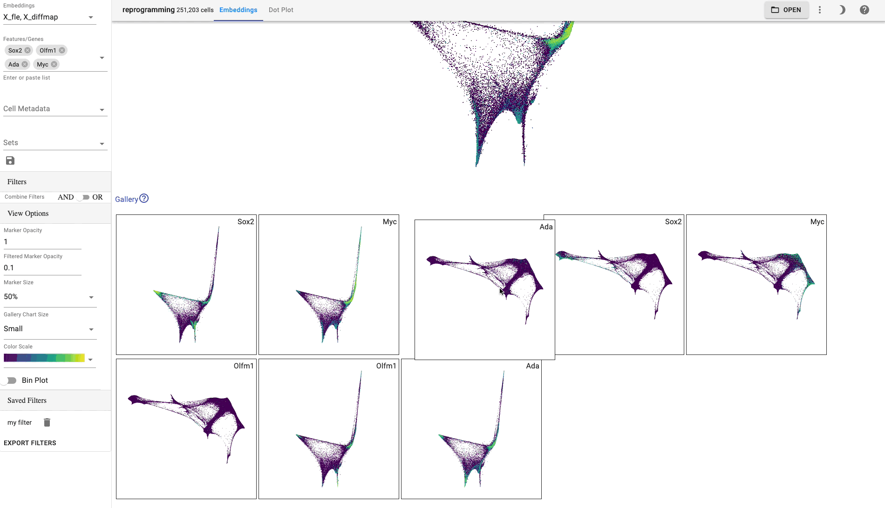

Side Bar
^^^^^^^^^^^

Embeddings: Select which cell embeddings to view. Select multiple embeddings to view more than one embedding simultaneously.

Genes/Features: Select genes/features to visualize. You can also paste a list of genes from your clipboard or drop a file with one gene per line. You can click on a chip to make it the primrary view.

Cell Metadata: Cell metadata, such as cluster labels, can be chosen from this field to view.

Sets: Sets allow you to save and view predefined lists of genes (e.g. cluster markers).

Filters: Shows the current datasets cell filters. Filters can be saved for later reuse and can be combined with "AND" or "OR" logic.
In server mode, filters are shared among dataset users, thus enabling real-time collaborative cell annotations.
Importantly, in addition to the cell ids selected by a filter, the provenance of the filter is saved for reproducibility.
You can download the selected cell ids as a new-line delimited text file by clicking the download button. To read the file in Python, use the code::

    import pandas as pd
    df = pd.read_csv(path, header=None, index_col=0)
    # subset dataset
    adata_subset = adata[adata.obs.index.isin(df.index)]

The right-hand side of the embedding plot allows you to filter cells using the selected attribute.

Filters operate on continuous values:

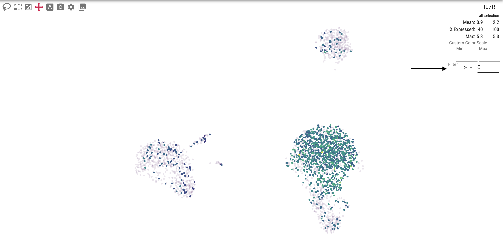

or categorical values:

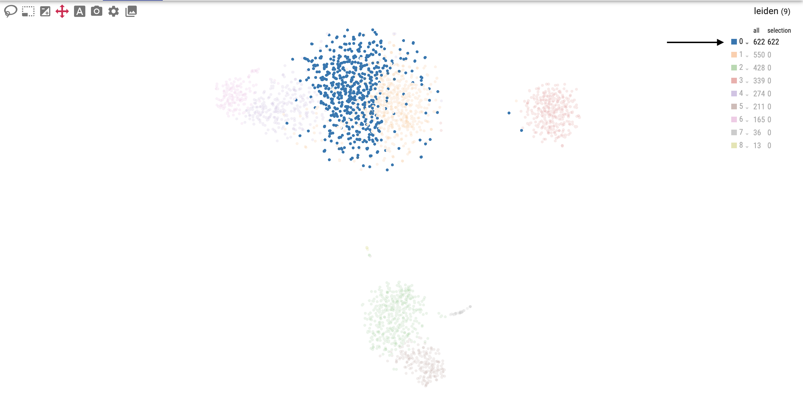

Run differential expression analysis:

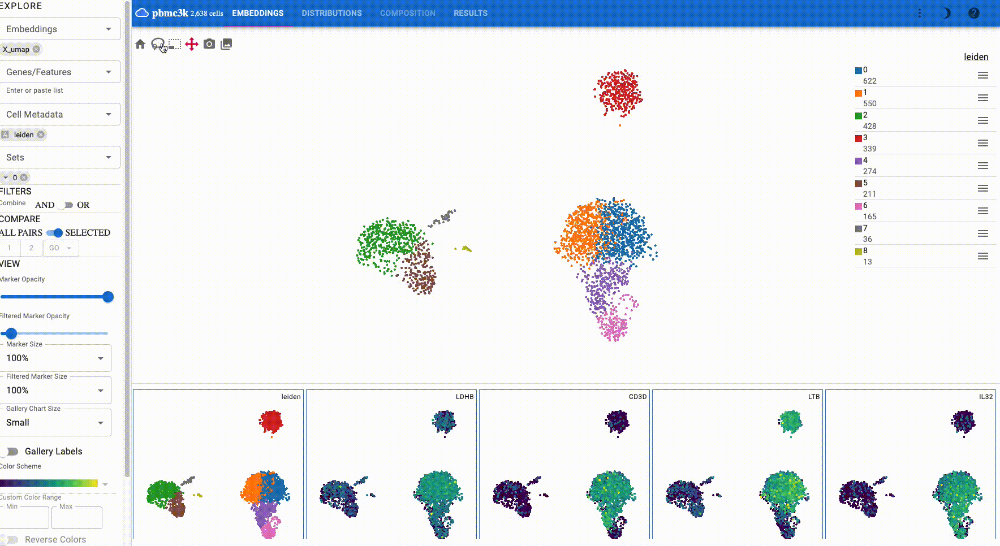

The side bar contains additional controls, such as the embedding point size and opacity.

Distributions
^^^^^^^^^^^^^^^

The "Distributions" tab allows users to explore gene distributions across cell categories using dot plots, heatmaps, or violin plots:

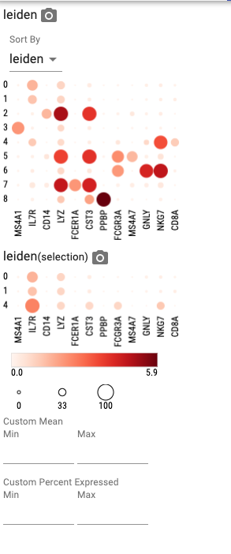

When selecting more than one category, the plot first groups by the primary category, then by the secondary category, etc.
For example, when you select "leiden" and "sample", the plot first groups by leiden cluster and then by sample.

Additionally, a composition plot shows categorical distributions:

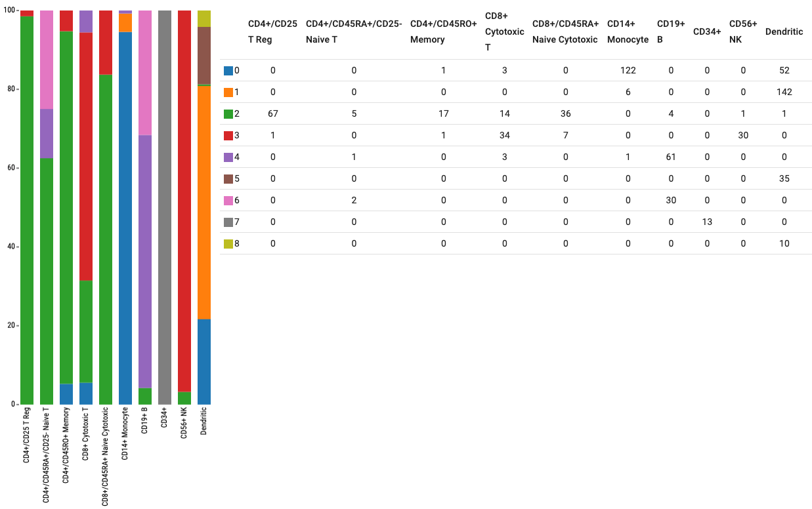

App Bar
^^^^^^^^^^

The app bar shows the number of cells in your dataset and the number of selected cells. Additionally, it
lets you switch between different tabs.

Share your visualization state with your collaborators by selecting "Copy Link" from the "More" menu.

