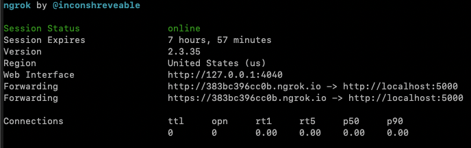
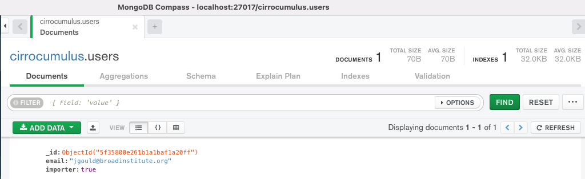

Installation
-------------

pip
^^^^^

- Install using pip::

    pip install cirrocumulus

- Launch via the command line::

    cirro launch <path_to_dataset>


Terra_ Cloud Environment
^^^^^^^^^^^^^^^^^^^^^^^^^^^^
- Click ``Open Terminal`` to connect to your running VM
- Install cirrocumulus via pip if it was not installed in your docker image
- Download your dataset to your running VM using gsutil as in the example below.
  Alternatively, you can use gcsfuse_ to mount your Google cloud bucket.

    gsutil -m cp gs://fc-000/test.h5ad .

- Launch cirrocumulus via the command line in the background::

    cirro launch test.h5ad &

- Install ngrok_::

    wget https://bin.equinox.io/c/4VmDzA7iaHb/ngrok-stable-linux-amd64.zip \
    && unzip ngrok-stable-linux-amd64.zip \
    && rm -f ngrok-stable-linux-amd64.zip

- Use ngrok_ to expose cirrocumulus publicly::

    ./ngrok http 5000

After you start ngrok, it will display a UI in your terminal with the public URL of your tunnel:



- Navigate to your public URL in your browser (\https://383bc396cc0b.ngrok.io in previous example)

Docker
^^^^^^^^

- Launch using docker::

    docker run -it -p 5000:5000 --rm -v `pwd`:/data cumulusprod/cirrocumulus cirro launch /data/dataset1.h5ad --host 0.0.0.0


UGER (Broad users only)
^^^^^^^^^^^^^^^^^^^^^^^^
Request an interactive UGER node with 4G memory::

    reuse UGER
    qrsh -q interactive -l h_vmem=4g

Add conda to your path::

    reuse Anaconda3

Activate your virtual environment containing cirrocumulus::

    source activate /path_to_your_conda_envs/cirrocumulus

Launch, specifying the host IP address::

    cirro launch <path_to_dataset> --host $(hostname -i)


Server Mode
^^^^^^^^^^^^^^

Cirrocumulus can also be run in `server` mode in order to serve multiple users and datasets securely.
The server can be deployed on a cloud VM, an on-premise machine, or on Google App Engine.


Server
^^^^^^^^

- Install cirrocumulus using pip or docker

- Optionally visit the `Google API Console`_ to obtain OAuth 2.0 credentials.

    - Create an OAuth client id. Set the OAuth consent screen application name and add your server URL to the list of “Authorized domains”
    - Go to Credentials and click “Create Credentials > OAuth client ID”. Enter “Web application” for “Application Type”
      and your server URL for “Authorized JavaScript origins”. Click “Create” to create the credentials.
    - Note that you need to install google-auth (`pip install google-auth`) to use Google OAuth.

- Install MongoDB_ and start the MongoDB server

- Start the server via the command line::

    cirro serve

You can see the full list of command line options by typing `cirro serve --help`.

- Use the `prepare_data` command to freeze an h5ad, loom, or Seurat file in cirrocumulus format. The cirrocumulus format allows efficient partial dataset retrieval over a network (e.g Google bucket) using limited memory.

- Add a dataset and optionally share with dataset with collaborators. If you enabled authentication, then no users are allowed to add datasets to cirrocumulus.
  Set the property "importer" to true on an entry in the users collection to enable that user to import datasets. For example, the following screenshot in `MongoDB Compass`_ shows that the user with the email address `me@gmail.com`, is allowed to add datasets to cirrocumulus:




- You can programmatically add a dataset by posting to the /api/dataset endpoint::

    curl http://localhost:5000/api/dataset -X POST -F 'name=my_name' -F 'url=data/my_dataset_path' -F 'description=my_desc'  -F 'species=Mus musculus'

- Please note that additional libraries are needed for cloud storage:

    - Amazon S3: `pip install s3fs`
    - Google Cloud Storage: `pip install gcsfs`
    - Microsoft Azure: `pip install adlfs`


Google App Engine
^^^^^^^^^^^^^^^^^^^

- Install the `Google Cloud SDK`_ if necessary. Type ``gcloud init`` in your terminal if this is your first time using the Google Cloud SDK.

- Clone the cirrocumulus app engine repository::

    git clone https://github.com/klarman-cell-observatory/cirrocumulus-app-engine.git

- Change your current working directory to cirrocumulus-app-engine::

    cd cirrocumulus-app-engine

- Create or use an existing GCP project in your Google Console.

- Please remember to replace <PROJECT> with your GCP project id in the following instructions.

- Create an App Engine application by navigating to App Engine > Dashboard. Select the Python Standard Environment and choose the region where your application is hosted.
  You can also create an application from the command line::

    gcloud app create --project=<PROJECT>

- Obtain OAuth 2.0 credentials.

    - Create an OAuth client id. Set the OAuth consent screen application name and add your server URL to the list of “Authorized domains”. Your server URL is \https://<PROJECT>.appspot.com.
    - Go to Credentials and click “Create Credentials > OAuth client ID”. Enter “Web application” for “Application Type”
      and your server URL for “Authorized JavaScript origins”. Click “Create” to create the credentials.

- Replace CIRRO_AUTH_CLIENT_ID in app.yaml with your OAuth client id. You can optionally edit `app.yaml`_ to further customize your application settings.

- Deploy the application using the command below. Your project is available at \https://<PROJECT>.appspot.com.::

    gcloud app deploy app.yaml --project=<PROJECT>

- Use the `prepare_data` command to freeze an h5ad, loom, or Seurat file in cirrocumulus format. The cirrocumulus format allows efficient partial dataset retrieval over a network (e.g Google bucket) using limited memory.

- Go to \https://<PROJECT>.appspot.com in your web browser and login.

    - By default, no one is allowed to add datasets to your application.
    - In Google Console, navigate to Datastore > Entities and click on your email address. Add the property ``importer`` of type ``boolean`` and set it to ``true``.
    - Go back to \https://<PROJECT>.appspot.com and start adding datasets.

- Read more about App Engine in the `App Engine`_ documentation.


Static Website
^^^^^^^^^^^^^^^^

- Clone the cirrocumulus repository::

    git clone https://github.com/klarman-cell-observatory/cirrocumulus.git

- Change to cirrocumulus directory::

    cd cirrocumulus


- Install typescript::

    yarn global add typescript

- Install JavaScript dependencies::

    yarn install

- Prepare dataset(s) in jsonl format::

    cirro prepare_data pbmc3k.h5ad --format jsonl

- Build JavaScript::

    REACT_APP_STATIC=true yarn build

- Create the file datasets.json in the build directory::

```json
    [
        {
            "id": "pbmc3k",
            "name": "pbmc3k",
            "url": "pbmc3k/pbmc3k.jsonl"
        }
    ]
```

- Move datasets files to build::

    mv pbmc3k build

- Test locally::

    cd build ; npx http-server .

- Host the build directory on your static website hosting service (e.g. GitHub Pages)


Developer Instructions
^^^^^^^^^^^^^^^^^^^^^^^^

- Create a new conda environment::

    conda create --name cirrocumulus-dev

- Clone the cirrocumulus repository::

    git clone https://github.com/klarman-cell-observatory/cirrocumulus.git

- Change to cirrocumulus directory::

    cd cirrocumulus

- Install cirrocumulus Python package in editable mode::

    pip install -e .

- Install additional optional dependencies::

    pip install s3fs tiledb

- Install typescript::

    yarn global add typescript

- Install JavaScript dependencies::

    yarn install

- Launch cirrocumulus with the --no-open flag::

    cirro launch path_to_h5ad_file --no-open

- Run JavaScript server in development mode::

    yarn start

- Navigate to http://localhost:3000

- In order to run End to End tests (yarn e2e), please install GraphicsMagick (brew install graphicsmagick on Mac)

- Testing::

    yarn e2e
    yarn test
    pytest


.. _app.yaml: https://cloud.google.com/appengine/docs/standard/python3/config/appref
.. _Google Cloud SDK: https://cloud.google.com/sdk/install
.. _App Engine: https://cloud.google.com/appengine/docs/
.. _Node.js: https://nodejs.org/
.. _ngrok: https://ngrok.com/
.. _Terra: https://app.terra.bio/
.. _MongoDB: https://www.mongodb.com/
.. _Google API Console: https://console.developers.google.com/
.. _gcsfuse: _https://github.com/GoogleCloudPlatform/gcsfuse/
.. _MongoDB Compass: _https://www.mongodb.com/products/compass
