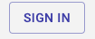
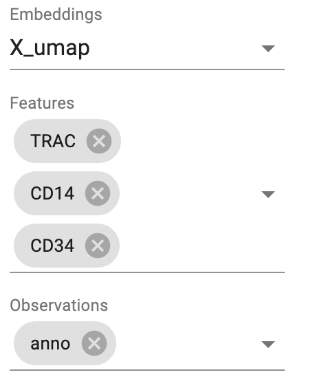
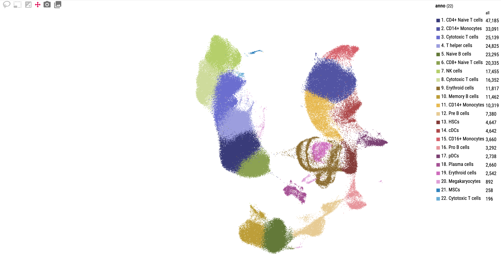
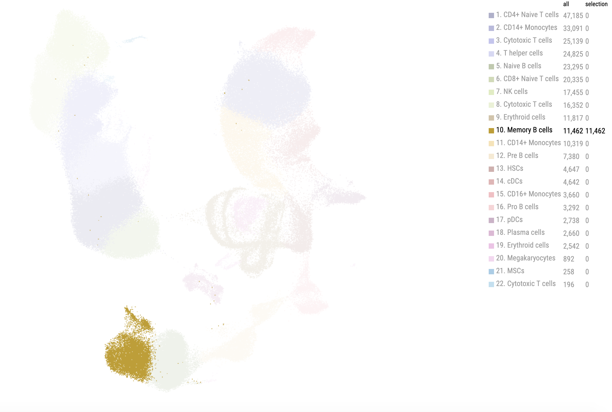
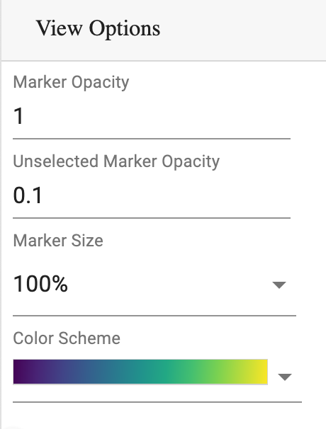
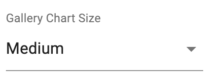
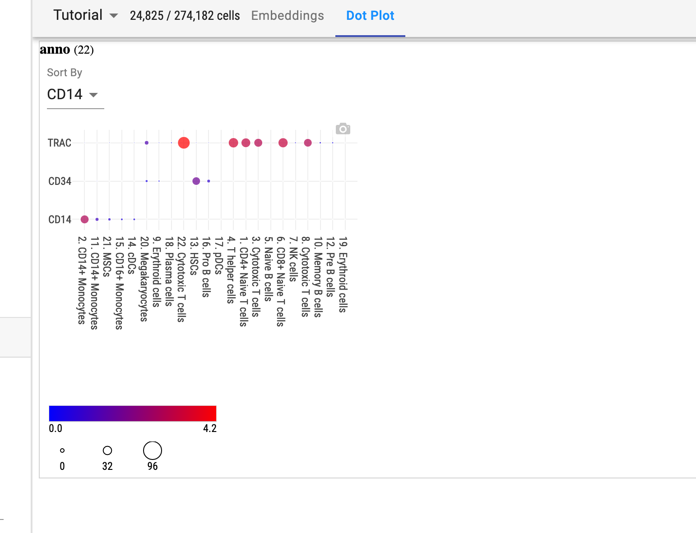
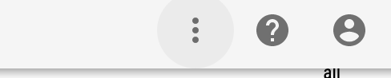

Tutorial
----------

This is a tutorial on using Cirrocumulus as a web application. 

Overview
^^^^^^^^^

The Cirrocumulus interface is as follows:

.. image:: images/overview.png

The left panel specifies the embedding and attributes of cells to visualize, as well as marker configurations.
All the plots are shown in the main window on its right-hand side, while the top panel is mainly to set the current user and dataset.

Open Dataset
^^^^^^^^^^^^^^

First, sign in to your Google account by clicking the ``SIGN IN`` button on the right-top corner:

After that, select the dataset you want to visualize from the drop-down menu on the top panel:

.. image:: images/choose-dataset.png
  :scale: 50%
  :align: center

View Embedding and Attributes
^^^^^^^^^^^^^^^^^^^^^^^^^^^^^^

After opening the dataset, you need to specify which embedding and cell attributes you want to see on the left panel:

Here is the detailed explanation on each field:

* **Embedding**: You can choose cell embeddings here for visualization. The embedding name indicates its algorithm: e.g. ``X_umap`` is for UMAP coordinates, ``X_fitsne`` for FIt-SNE, ``X_fle`` for force-directed layout, ``X_pca`` for PCA, etc. You can view multiple embeddings at the same time.

* **Features**: You can view feature plots by selecting genes from this field. Either choose from the drop-down menu, or type in this field, with candidate genes provided while you are typing, and select the gene you want.

* **Observations**: Cell attributes can be chosen from this field to view.

Main plot view
^^^^^^^^^^^^^^^^^^^

The default view is a main interactive embedding plot, as the example below:

You can scroll your mouse to zoom in/out the main plot. Alternatively, there is an interaction toolbox on the left-top side:

From left to right are: *Lasso selection*, *Box selection*, *Append to selection*, *Move viewpoint*, *Save to image*, and *View Gallery*.

By default, *Move viewpoint* is activated, and you can move the viewpoint by dragging your cursor on the main plot. You can select a specific area to view by switching to one of the three selections provided in the toolbox. By clicking *Save to image* button, you can save the current plot as a png file. The last *View Gallery* button is to switch to Gallery view, which will be discussed in next section.

Moreover, as the main plot is interactive, you can see the attribute of each data point (i.e. cell) by moving your cursor to its location on the plot. 

You can also select cells with the same status by clicking the corresponding name from legend:

As a result, this specific class of cells is highlighted. You can click the same name once more to go back to the normal plot.

You can adjust the main plot using the view options on the left panel:

Gallery view
^^^^^^^^^^^^^^^^^^^

You can switch to the gallery view by clicking the *View Gallery* button in the toolbox of the main plot:

.. image:: images/gallery.png
  :align: center

As you can see from the example above, gallery view provides a way from comparing plots. Legend can be viewed from the left panel.

Moreover, when you select a specific class of cells, and then switch to gallery view, you'll see that all the plots have these cells highlighted:

.. image:: images/gallery-select.png
  :align: center

You can also change the gallery plots' size using the following option on the left panel:

Dot plot view
^^^^^^^^^^^^^^^

Besides scatterplots under cell embedding, you can also check gene distributions regarding cell types using dot plots:

You can switch to this view by selecting ``Dot Plot`` from the top tab.

Share Results
^^^^^^^^^^^^^^

Finally, when you are done with visualization, and want to share plots with your collaborators, you can click the left-most button on the right-top corner, and choose ``Copy Link`` in the drop-down menu:

Now you can send the URL you just copied to others.