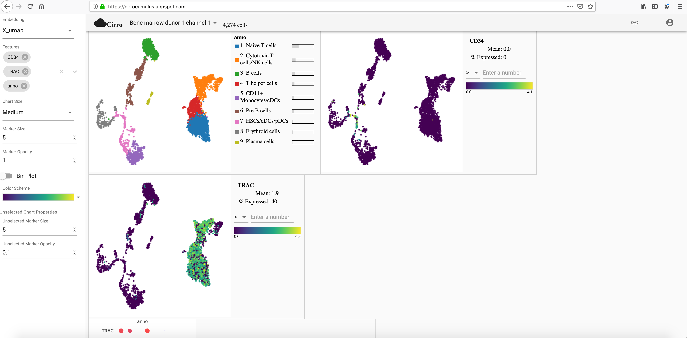
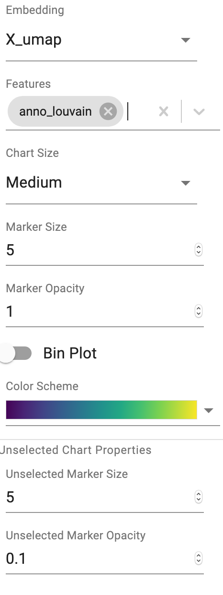
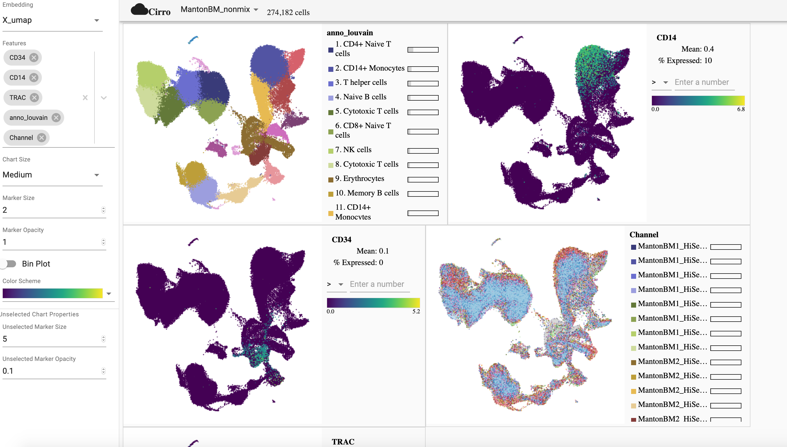
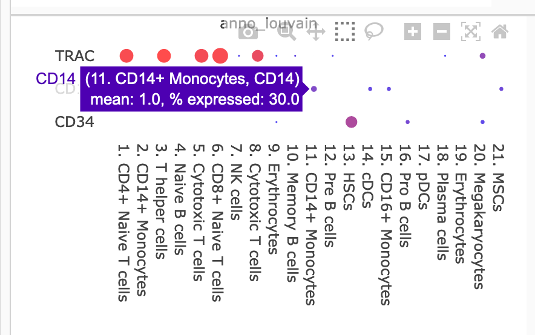
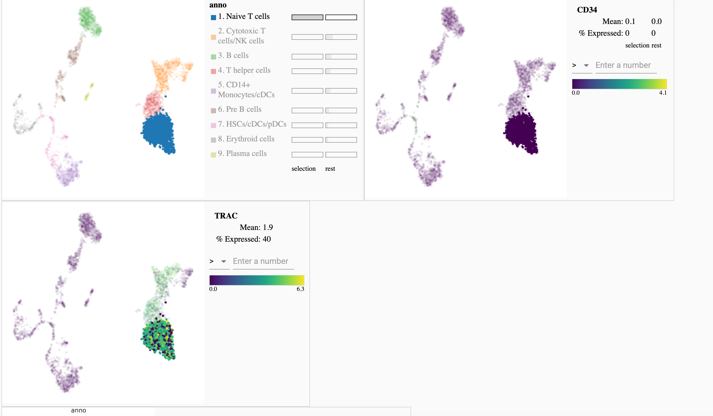
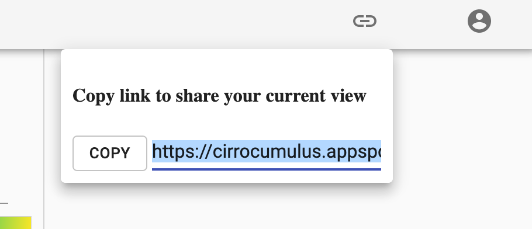

Tutorial
----------

This is a tutorial on using Cirrocumulus as a web application. 

Overview
^^^^^^^^^

Cirrocumulus is deployed on Google App Engine at https://cirrocumulus.appspot.com. Its interface is as the following:

The left panel specifies the embedding and attributes of cells to visualize, as well as marker configurations. All the plots are shown in the main window on its right-hand side, while the top panel is mainly to set the current user and dataset.

Assuming you already registered on `Terra <https://app.terra.bio>`_, and have access to your dataset, starting from the next section, you'll learn how to use Cirrocumulus for data visualization.

Open Dataset
^^^^^^^^^^^^^^

First, sign in to your Terra account by clicking the ``SIGN IN`` button on the right-top corner:

After that, select the dataset you want to visualize from the drop-down menu on the top panel:

View Embedding and Attributes
^^^^^^^^^^^^^^^^^^^^^^^^^^^^^^

After opening the dataset, you need to specify which embedding and cell attributes you want to see on the left panel:

Below is the detailed explanation on each item:

* **Embedding**: You can choose only one cell embedding at a time for visualization. The embedding name indicates its algorithm: e.g. ``X_umap`` is for UMAP coordinates, ``X_fitsne`` for FIt-SNE, ``X_fle`` for force-directed layout, ``X_pca`` for PCA, etc.

* **Features**: You can select multiple cell features for visualization, each of which will be shown in a seperate plot with the embedding you specify above. There are two ways for selection:

    * **Annotations**: By clicking the drop-down menu of *Feature* field, you'll see a list of annotation attributes. These are cell attributes, such as cell type annotations, 10x channel information, etc. You can select them by clicking from the menu.

    * **Genes**: You may also want to see feature plots with respect to some genes. In this case, you'll need to type in *Feature* field, with candidate genes provided while you are typing. Then you can be sure if the gene name you want to see is in the dataset, and if so, select it by finishing the typing and press ``Enter`` button from you keyboard.

* **Plot configuration**: You can set plot size in **Charter Size** field, set data point size in **Marker Size** (larger number gives larger points), set data point opacity in **Marker Opacity** (a number between ``0`` and ``1``, smaller number gives more transparent points), and change plot color scheme in **Color Scheme** field.

Above is an example to show UMAP embedding of cells with their cell type annotation and 10x channel information, as well as feature plots regarding genes CD34, CD14, and TRAC. Marker size is set to ``2`` to make the plots more readable.

Furthermore, besides these scatterplots, Cirrocumulus also shows dot plots of all the selected genes against each selected categorical cell attribute, respectively. Below is an example of Genes CD34, CD14, and TRAC against cluster-based cell type annotations:

.. image:: images/tutorial-05.png
  :scale: 40%
  :align: center

From this dot plot, as TRAC is an important marker for T cells, we can easily see that all the clusters annotated as T cells are consistent with expressions regarding TRAC.

Moreover, as all the plots in Cirrocumulus are interactively, you can check the gene expression information of each cluster by simply moving your mouse to the dot you are interested in:

View a Specific Group of Cells
^^^^^^^^^^^^^^^^^^^^^^^^^^^^^^^^

Besides showing the whole dataset, you can also view a group of cells of interest by directly clicking its name from the legend. After a while, you'll see that all the unselected groups are set to be translucent. For example, in the plots below, I only select the first cluster:

You can clearly see that TRAC is highly expressed in this cluster, while CD34 is not.

You can click the name once more to go back to the whole dataset visualization.

Moreover, if you want to hide unselected cells, simply set **Unselected Marker Opacity** in the left panel (see below) to ``0``, and press Enter button on your keyboard:

Share Results
^^^^^^^^^^^^^^

Finally, when you are done with visualization, and want to share plots with your collaborators, you can click the following button on the top panel:

Then click the ``COPY`` button, and paste the URL in your email sent to your collaborators.